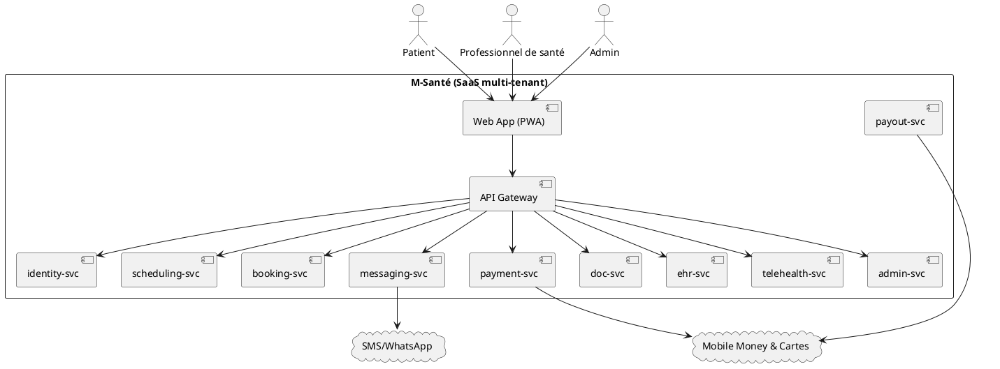
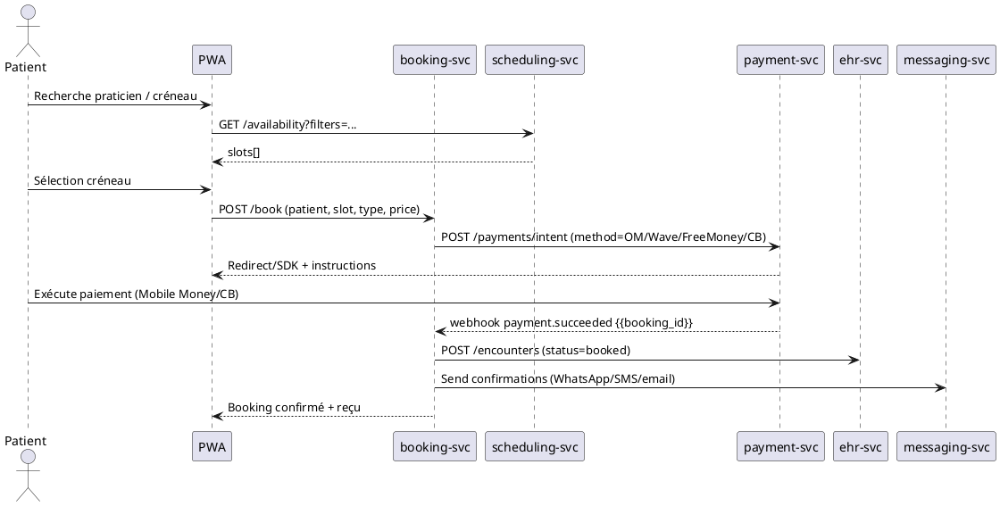

# Cahier des Charges & Architecture — **Projet M‑Santé**
*Version 1.0 — 16 August 2025*

> **Objet** : Décrire, avec un niveau de détail exécutable par un agent d’ingénierie, la vision, le périmètre, l’architecture cible (fonctionnelle, applicative et technique), la conformité et le plan de mise en œuvre d’une plateforme web/mobile de e‑santé pour le Sénégal et l’Afrique de l’Ouest, intégrant réservation de rendez‑vous, paiement Mobile Money (Orange Money, Wave, Free Money) et dossiers patients sécurisés.

---

## 1. Présentation & Vision
**M‑Santé** connecte **patients** et **professionnels de santé** (médecins, psychologues, coachs, paramédicaux…) pour faciliter la **prise de rendez‑vous** (présentiel & visio), les **paiements locaux**, la **communication sécurisée** et la **gestion du dossier patient**.

**Objectif principal :** démocratiser l’accès aux soins, fluidifier la prise de rendez‑vous et garantir un **parcours de santé digitalisé, sécurisé et inclusif**, adapté aux usages locaux (mobile‑first, multilingue FR/EN/Wolof, WhatsApp/SMS, réseau à faible débit).

**Valeur clé :**
- Réservation simple, mode invité pris en charge (OTP par SMS/WhatsApp) ;
- Téléconsultation WebRTC fiable sur faible bande passante (fallback audio) ;
- Paiement **mobile‑first** avec preuves de paiement et **reversement** automatisé ;
- Dossiers patients sécurisés, consentement numérique et audit complet ;
- Conformité **CDP** (Sénégal) & **RGPD** (si données UE) ; hébergement local/régional.

---

## 2. Objectifs & Périmètre
### 2.1 Objectifs clés
- **Accessibilité** : Web responsive + PWA ; i18n FR/EN/Wolof ; UX locale.
- **Conformité** : Loi sénégalaise (CDP), RGPD si pertinent ; résidence des données (datacenters au Sénégal ou régions conformes).
- **Paiement mobile‑first** : Orange Money, Wave, Free Money, cartes ; commissions configurables ; remboursements selon politique.
- **Comptes & vérification** : KYC praticiens (CNI/diplômes), horaires, absences.
- **Réservation & paiement** : créneaux filtrables, annulation/remboursement paramétrable.
- **Notifications** : SMS, WhatsApp, email (priorité WhatsApp/SMS).
- **Sécurité** : 2FA, OTP, chiffrement, consentement explicite, journalisation/audit.
- **Messagerie interne** : partages de documents ; garde‑fous (pas d’urgence médicale).
- **Dossier patient** : historique, stockages chiffrés, transmission sécurisée.
- **Support & évolutivité** : FAQ, guides, support localisé, modules futurs (pharmacie, labos, télémédecine).

### 2.2 Hors périmètre (MVP)
- Prescriptions électroniques signées légalement, DMP étatique (intégration ultérieure).
- Intégrations assurance santé avancées (phase 2+).
- Dossiers cliniques fortement normés par spécialité (phase 2 : FHIR étendu).

---

## 3. Rôles & Personae
- **Patient/Client** : réservation (avec/sans compte), paiement, messagerie, documents, historique.
- **Professionnel de santé** : profil vérifié, agenda, RDV, visio, notes basiques, factures, reversements, statistiques.
- **Administrateur (tenant/clinique)** : validation praticiens, configuration politiques (annulations, langues, commissions), modération.
- **Super‑admin (plateforme)** : supervision globale, anti‑fraude, incidents, conformité, exports légaux.
- **Support** : traitement litiges, remboursements manuels, KYC.

---

## 4. Fonctionnalités détaillées
### 4.1 Patients
- **Création de compte** par téléphone/email (OTP SMS/WhatsApp) ; **mode invité** (nom, prénom, téléphone, OTP).
- **Réservation** : recherche multi‑critères (spécialité, langue, tarif, disponibilité, visio/présentiel) ; sélection créneau ; **paiement** ; **preuve** (reçu + code/lien/QR).
- **Lien temporaire** de gestion de RDV (jusqu’à la date), annulation/remboursement selon politique.
- **Messagerie sécurisée** avec praticien ; documents (compte rendu, reçus).
- **Historique** des RDV et reçus ; conversion en compte complet.

### 4.2 Professionnels
- **Onboarding KYC** (CNI, diplôme, photo, RIB/IBAN/Mobile Money pour reversement) ; validation manuelle.
- **Paramétrage** des horaires, vacances, absences ; buffers ; types d’actes & tarifs.
- **Gestion RDV** (confirmations, annulations, no‑show), visio (WebRTC), notes (simples) et documents.
- **Paiements & reversements** : tableau de bord, export PDF/Excel, états de rapprochement.
- **Statistiques** : taux d’annulation, taux de présence, chiffre d’affaires, temps moyen.

### 4.3 Administrateurs / Super‑admin
- **Validation profils** praticiens ; suspension ; modération contenus/communications.
- **Règles** : annulations/remboursements, commissions, langues, guides ; templates messages.
- **Suivi global** : statistiques, paiements, incidents, audit ; envoi notifications globales.
- **Journalisation** : extractions, archivage légal, gestion des demandes d’accès aux données.

### 4.4 Paiement & Reversement
- **Moyens** : OM, Wave, Free Money, cartes via agrégateur local.
- **Reversements** : J+N, minimum de versement, manuel/automatique, frais/commissions.
- **Remboursements** : politique paramétrable (cf. §11), partiel/total, automatique/manualisé.
- **Facturation** : reçus PDF, bordereaux Excel, pièces justificatives.

### 4.5 Messagerie & Support
- **Messagerie interne** (non‑urgences) ; partage de documents (PDF, images) ; limites de taille.
- **Notifications** : SMS/WhatsApp/email ; modèles localisés.
- **Support** : WhatsApp pro, centre d’aide, formulaire de contact ; SLA réponse.

### 4.6 Dossier patient (MVP)
- **Fiche patient** : données démographiques minimales, contacts, consentements.
- **Historique RDV**, documents liés, reçus, notes succinctes (non diagnostic officiel).

### 4.7 Téléconsultation
- **WebRTC** (TURN obligatoire, SFU optionnelle pour groupes) ; **watermark**, pas d’enregistrement par défaut ; test réseau/équipement ; **fallback audio**.

---

## 5. Exigences réglementaires & sécurité
- **CDP (Sénégal)** : protection des données personnelles ; registre de traitements ; finalités ; DPO ; droits des personnes (accès, rectification, suppression).
- **RGPD (si utilisateurs/traitements UE)** : bases légales, consentement explicite, minimisation, DPIA si nécessaire.
- **Résidence des données** : hébergement local (Sonatel, OVH Dakar) ou région conforme ; chiffrement au repos (AES‑256) & en transit (TLS 1.2+). 
- **Journalisation/Audit** : accès au dossier, téléchargement, actions d’admin ; horodatage et traçabilité immuable.
- **Sécurité** : 2FA pour praticiens/admin ; OTP pour patients ; mot de passe fort ; gestion de session ; rotation de secrets ; WAF/Rate‑limit ; anti‑fraude paiements.
- **Consentement** : explicite, horodaté, révocable ; bannières & politiques (CGU/CGV).
- **Rétention** : règles par catégorie (paiements, logs, dossier patient) ; purge & export chiffrés.

---

## 6. Architecture cible (vue d’ensemble)
### 6.1 Style & Tenancy
- **SaaS multi‑tenant** : isolation logique par `tenant_id` (clinique/professionnel), **RLS** PostgreSQL, clés KMS par tenant (si disponible).
- **Microservices** (domain‑driven) + **API Gateway** ; **événements** asynchrones (SQS/Kafka) ; **webhooks** pour partenaires.

### 6.2 Services principaux
1. **identity‑svc** : OIDC, JWT, 2FA, OTP, RBAC/ABAC (rôles: patient, pro, admin, superadmin) ; KYC workflow.
2. **profile‑svc** : profils patients/pros, documents KYC, vérifications, statuts.
3. **scheduling‑svc** : agendas, créneaux, règles d’annulation, zones horaires, buffers.
4. **booking‑svc** : réservation, tenue d’options, politiques de paiement, vouchers.
5. **payment‑svc** : intégrations Mobile Money & cartes, preuves de paiement, rapprochement, remboursements ; calcul des **commissions**.
6. **payout‑svc** : reversements (J+N), fichiers de paiement/ordres, états.
7. **messaging‑svc** : messages internes, notifications (SMS/WhatsApp/email), templates localisés.
8. **doc‑svc** : stockage S3‑compatible chiffré, liens sécurisés, signatures électroniques légères.
9. **ehr‑svc (MVP light)** : fiches patients, consentements, documents, notes basiques.
10. **telehealth‑svc** : signalisation WebRTC, TURN/SFU, salles, vérif réseau, tokens éphémères.
11. **admin‑svc** : modération, configuration, audit, rapports.
12. **reporting‑svc** : agrégations, tableaux de bord, export PDF/Excel.
13. **web‑app** (React PWA) & **public API** (REST/OpenAPI 3.1).

### 6.3 Diagramme de contexte (PlantUML)


### 6.4 Séquence — Réservation & Paiement (PlantUML)


### 6.5 Architecture technique (cible hébergeur local ou cloud public)
- **Frontend** : React 18 + PWA (Workbox), i18n (FR/EN/Wolof), offline cache, Background Sync.
- **Backend** : Java 23 / Spring Boot 3.x (hexagonal), OpenAPI 3.1, MapStruct, Validation.
- **Base de données** : PostgreSQL 15+ (RLS multi‑tenant, PITR), Redis (cache/OTP/rate limit).
- **Stockage objets** : S3‑compatible (OVH, Cloudian, MinIO) avec chiffrement côté serveur.
- **Messagerie** : Kafka ou SQS/SNS (selon hébergeur) ; workers pour webhooks/notifications.
- **Téléconsultation** : coturn (TURN), SFU (Janus/mediasoup) option ; tokens courts signés.
- **Intégrations** : SMS/WhatsApp Business API (ou agrégateur local), PSP locaux (OM, Wave, Free Money), mail (SMTP).
- **Sécurité** : OAuth2/OIDC, JWT courts, cookies HttpOnly, WAF, CSP, secrets en **Vault**/Secrets Manager.
- **Observabilité** : OpenTelemetry, logs structurés, métriques Prometheus/Grafana, alertes.
- **CI/CD** : GitHub Actions, tests (unit/integration), SAST/DAST, IaC (Terraform), déploiement Helm/Argo Rollouts.
- **Réseau** : LB/Ingress, TLS (Let’s Encrypt/ACME), rate‑limit, IP allow‑lists pour admin.

---

## 7. Modèle de données (extraits PostgreSQL)
```sql
CREATE TABLE tenant (
  tenant_id UUID PRIMARY KEY,
  name TEXT NOT NULL,
  country_code CHAR(2) NOT NULL DEFAULT 'SN',
  created_at TIMESTAMPTZ NOT NULL DEFAULT now()
);

CREATE TABLE user_account (
  user_id UUID PRIMARY KEY,
  tenant_id UUID REFERENCES tenant(tenant_id),
  role TEXT NOT NULL CHECK (role IN ('patient','pro','admin','superadmin')),
  phone TEXT, email TEXT,
  locale TEXT NOT NULL DEFAULT 'fr',
  twofa_enabled BOOLEAN NOT NULL DEFAULT false,
  status TEXT NOT NULL DEFAULT 'active',
  created_at TIMESTAMPTZ NOT NULL DEFAULT now()
);

CREATE TABLE practitioner_verification (
  verification_id UUID PRIMARY KEY,
  user_id UUID NOT NULL REFERENCES user_account(user_id),
  id_number TEXT, diploma_ref TEXT, documents JSONB,
  status TEXT NOT NULL CHECK (status IN ('pending','approved','rejected')),
  reviewed_by UUID, reviewed_at TIMESTAMPTZ
);

CREATE TABLE availability_slot (
  slot_id UUID PRIMARY KEY,
  tenant_id UUID NOT NULL REFERENCES tenant(tenant_id),
  practitioner_id UUID NOT NULL REFERENCES user_account(user_id),
  starts_at TIMESTAMPTZ NOT NULL,
  ends_at TIMESTAMPTZ NOT NULL,
  mode TEXT NOT NULL CHECK (mode IN ('in_person','video')),
  price_cfa INT NOT NULL,
  is_booked BOOLEAN NOT NULL DEFAULT false
);

CREATE TABLE booking (
  booking_id UUID PRIMARY KEY,
  tenant_id UUID NOT NULL REFERENCES tenant(tenant_id),
  patient_id UUID NOT NULL REFERENCES user_account(user_id),
  practitioner_id UUID NOT NULL REFERENCES user_account(user_id),
  slot_id UUID NOT NULL REFERENCES availability_slot(slot_id),
  status TEXT NOT NULL CHECK (status IN ('pending_payment','confirmed','cancelled','refunded','no_show','completed')),
  created_at TIMESTAMPTZ NOT NULL DEFAULT now()
);

CREATE TABLE payment (
  payment_id UUID PRIMARY KEY,
  booking_id UUID NOT NULL REFERENCES booking(booking_id),
  method TEXT NOT NULL CHECK (method IN ('orange_money','wave','free_money','card')),
  amount_cfa INT NOT NULL,
  commission_cfa INT NOT NULL DEFAULT 0,
  status TEXT NOT NULL CHECK (status IN ('initiated','succeeded','failed','refunded','chargeback')),
  reference TEXT, proof_url TEXT,
  created_at TIMESTAMPTZ NOT NULL DEFAULT now()
);

CREATE TABLE payout (
  payout_id UUID PRIMARY KEY,
  practitioner_id UUID NOT NULL REFERENCES user_account(user_id),
  period_start DATE NOT NULL, period_end DATE NOT NULL,
  amount_net_cfa INT NOT NULL, status TEXT NOT NULL CHECK (status IN ('scheduled','sent','failed')),
  created_at TIMESTAMPTZ NOT NULL DEFAULT now()
);

CREATE TABLE message (
  msg_id UUID PRIMARY KEY,
  tenant_id UUID NOT NULL REFERENCES tenant(tenant_id),
  sender_id UUID NOT NULL REFERENCES user_account(user_id),
  recipient_id UUID NOT NULL REFERENCES user_account(user_id),
  body TEXT NOT NULL, attachments JSONB,
  created_at TIMESTAMPTZ NOT NULL DEFAULT now()
);
```

**Multi‑tenancy** : activer **RLS** sur toutes les tables scindées par `tenant_id` et appliquer des policies strictes. 

---

## 8. API (REST/OpenAPI 3.1 – extraits)
```yaml
openapi: 3.1.0
info: { title: M-Santé Public API, version: 1.0.0 }
paths:
  /auth/otp:
    post:
      summary: Demander un OTP SMS/WhatsApp
      requestBody:
        required: true
        content:
          application/json:
            schema:
              type: object
              properties: { phone: { type: string }, channel: { type: string, enum: [sms, whatsapp] } }
      responses: { '204': { description: Envoyé } }

  /bookings:
    post:
      summary: Créer une réservation (peut être invité)
      requestBody:
        required: true
        content:
          application/json:
            schema:
              type: object
              required: [practitionerId, slotId, contact]
              properties:
                practitionerId: { type: string, format: uuid }
                slotId: { type: string, format: uuid }
                contact:
                  type: object
                  properties: { name: { type: string }, phone: { type: string }, email: { type: string } }
                mode: { type: string, enum: [in_person, video] }
      responses:
        '201': { description: Réservation créée, statut pending_payment }

  /payments/intents:
    post:
      summary: Créer une intention de paiement (OM/Wave/FreeMoney/CB)
      requestBody:
        required: true
        content:
          application/json:
            schema:
              type: object
              required: [bookingId, method]
              properties:
                bookingId: { type: string, format: uuid }
                method: { type: string, enum: [orange_money, wave, free_money, card] }
      responses: { '200': { description: Détails d’exécution (redirect/USSD/SDK) } }

  /webhooks/payments/mobilemoney:
    post:
      summary: Webhook PSP — status paiement
      responses: { '204': { description: Ack } }
```

**Événements (webhooks sortants)** : `booking.confirmed`, `booking.cancelled`, `payment.succeeded`, `payment.failed`, `refund.processed`, `payout.sent`.

---

## 9. Politiques — Annulation & Remboursement (paramétrable)
- **Annulation sans frais** : jusqu’à **72h** avant RDV (valeur par défaut ; configurable par tenant).
- Au‑delà : **pénalité** (pourcentage X% ou montant Y FCFA) ; **no‑show** = non remboursable (option).
- **Remboursement** : automatique sous 72h via le même moyen de paiement ; cas de force majeure = traitement manuel par support (journalisé).
- **Paramétrage** exposé via `admin‑svc` ; politiques versionnées ; affichage clair aux utilisateurs (CGU/CGV).

---

## 10. Expérience utilisateur (UX/UI)
- **Mobile‑first** (≥ 360px), PWA installable, icônes, splash, offline partiel.
- **Low‑bandwidth** : images compressées, lazy‑loading, fallback texte, **USSD/SMS** pour rappels & OTP.
- **Accessibilité** : contrastes, textes clairs, prise en charge lecteurs d’écran.
- **Localisation** : FR/EN/Wolof, formats date/heure locaux, monnaie **FCFA**.

---

## 11. Opérations & Exploitabilité
- **Observabilité** : traces, métriques (taux de succès paiements, délais reversement, latences RDV), journaux centralisés.
- **Backups** : PostgreSQL PITR, snapshots objets, tests de restauration réguliers.
- **Gestion incidents** : on‑call, runbooks, post‑mortems, communication statut.
- **Sécurité opérationnelle** : rotation clés/Secrets, scans SAST/DAST, durcissement images.
- **Anti‑fraude** : limites par appareil/compte, listes bloquées, vérif incohérences paiements.

---

## 12. Non‑fonctionnels (SLO cibles)
- **Disponibilité** : 99,9% mensuel (MVP), 99,95% cible.
- **Perf API** : P95 lecture < 300 ms ; écriture < 600 ms.
- **Paiement** : ≥ 99% webhooks traités < 60 s.
- **Support** : réponses < 4 h (Ouvrées), incidents P1 < 30 min d’accusé.
- **Sécurité** : 2FA obligatoire pour pros/admin, OTP pour patients ; test d’intrusion avant GA.

---

## 13. Déploiement (exemple Kubernetes + Terraform)
```yaml
# ConfigMap de base (extrait)
apiVersion: v1
kind: ConfigMap
metadata: { name: msante-config, namespace: platform }
data:
  APP_LOCALE_DEFAULT: "fr"
  APP_TIMEZONE: "Africa/Dakar"
  PAYMENT_METHODS: "orange_money,wave,free_money,card"
---
apiVersion: apps/v1
kind: Deployment
metadata: { name: booking-svc, namespace: platform }
spec:
  replicas: 2
  selector: { matchLabels: { app: booking-svc } }
  template:
    metadata: { labels: { app: booking-svc } }
    spec:
      containers:
        - name: app
          image: ghcr.io/msante/booking-svc:1.0.0
          ports: [{ containerPort: 8080 }]
          securityContext:
            allowPrivilegeEscalation: false
            readOnlyRootFilesystem: true
```

---

## 14. Plan projet & jalons
- **S0–S2** : cadrage, maquettes, sélection hébergeur local, DPIA/CDP.
- **S3–S6** : MVP (auth/OTP, recherche RDV, booking, paiements, notifications, visio basique).
- **S7–S9** : KYC complet, reversements, reporting, admin avancé, politiques rembours.
- **S10–S12** : pilotes (2–3 cliniques), retours, stabilisation, sécurité/pen‑test, GA.
- **Livrables** : OpenAPI, manuels utilisateurs, tests UAT, packs d’onboarding.

---

## 15. Backlog Epics (extraits & critères d’acceptation)
1. **Auth & OTP** : En tant que patient, je peux recevoir un OTP via SMS/WhatsApp et me connecter sans mot de passe.
   - *Done quand* : OTP limite tentatives, expiration 5 min, journalisé, rate‑limit.
2. **Recherche & Booking** : En tant que patient, je filtre par spécialité, langue, tarif et mode.
   - *Done quand* : résultats < 1 s pour 5 000 créneaux, booking idempotent, double‑booking impossible.
3. **Paiements** : En tant que patient, je règle mon RDV via OM/Wave/Free Money/CB et reçois un reçu.
   - *Done quand* : webhook idempotent, preuve associée, état `confirmed` en < 60 s.
4. **Reversements** : En tant que pro, je reçois mes reversements selon ma fréquence.
   - *Done quand* : états clairs (`scheduled/sent/failed`), export Excel, support réémission.
5. **Messagerie** : En tant que patient/pro, je peux échanger des messages non urgents.
   - *Done quand* : chiffrement en transit, limites taille/volume, notifications envoyées.
6. **Téléconsultation** : En tant que patient, je joins une visio fiable.
   - *Done quand* : test réseau OK, fallback audio, token < 10 min, TURN opérationnel.
7. **Admin & Conformité** : DPO peut extraire audit et gérer politiques.
   - *Done quand* : export complet en JSON/CSV/PDF, audit inviolable, CGU affichées et acceptées.

---

## 16. Instructions “Prompt Agent” — livrables attendus automatiquement
> **Rôle** : Tu es un agent d’ingénierie principal chargé de générer artefacts et squelettes de code à partir de ce cahier.
- Génère **squelettes** de services Spring Boot 3 (Java 23) pour `identity‑svc`, `scheduling‑svc`, `booking‑svc`, `payment‑svc`, `messaging‑svc` avec **OpenAPI 3.1** minimal, Dockerfile, Helm Chart.
- Crée une **web‑app React PWA** (Vite) avec i18n (FR/EN/Wolof), pages : *Recherche, Fiche praticien, Réservation, Paiement, Espace patient, Connexion OTP*. 
- Produit un **module SDK** TypeScript pour appeler l’API (auth OTP, bookings, payments).
- Ajoute **workflow GitHub Actions** : build, tests, SAST, container scan, déploiement Helm (environnement `dev`).
- Émet un **jeu de données seed** (10 pros, 50 créneaux, 20 bookings) et **scripts SQL** d’initialisation (tables ci‑dessus). 
- Fournit **PlantUML** et **OpenAPI** générés, plus un **README** d’installation local (Docker Compose : Postgres, MinIO, coturn).

**Contraintes de production** : 
- JWT ≤ 15 min, refresh tokens rotatifs, 2FA obligatoire pour pros/admin. 
- Latence P95 API ≤ 600 ms, disponibilité ≥ 99.9%. 
- Stockage chiffré, secrets hors code, logs sans PII. 

**Fichiers à sortir** : 
- `services/*` (Spring Boot) ; `web/` (React PWA) ; `deploy/helm/*` ; `openapi/*.yaml` ; `docs/plantuml/*.puml` ; `db/migrations/*.sql` ; `seeds/*.sql` ; `ops/runbooks/*.md`.

---

## 17. Annexes
### 17.1 Modèle de message (WhatsApp/SMS — confirmation)
```
[M‑Santé] Bonjour {prenom}, votre RDV avec {pro_nom} le {date_heure} est confirmé.
Lieu: {adresse|Visio} • Code: {code}
Modifiez/annulez: {lien}
Besoin d’aide? Répondez à ce message.
```
### 17.2 Modèle CGU/Consentement (extrait)
- Finalités : gestion de RDV, paiements, communication non urgente.
- Base légale : consentement, exécution de contrat.
- Droits : accès, rectification, suppression, portabilité.
- Contact DPO : dpo@msante.sn

---

*Fin du document.*
