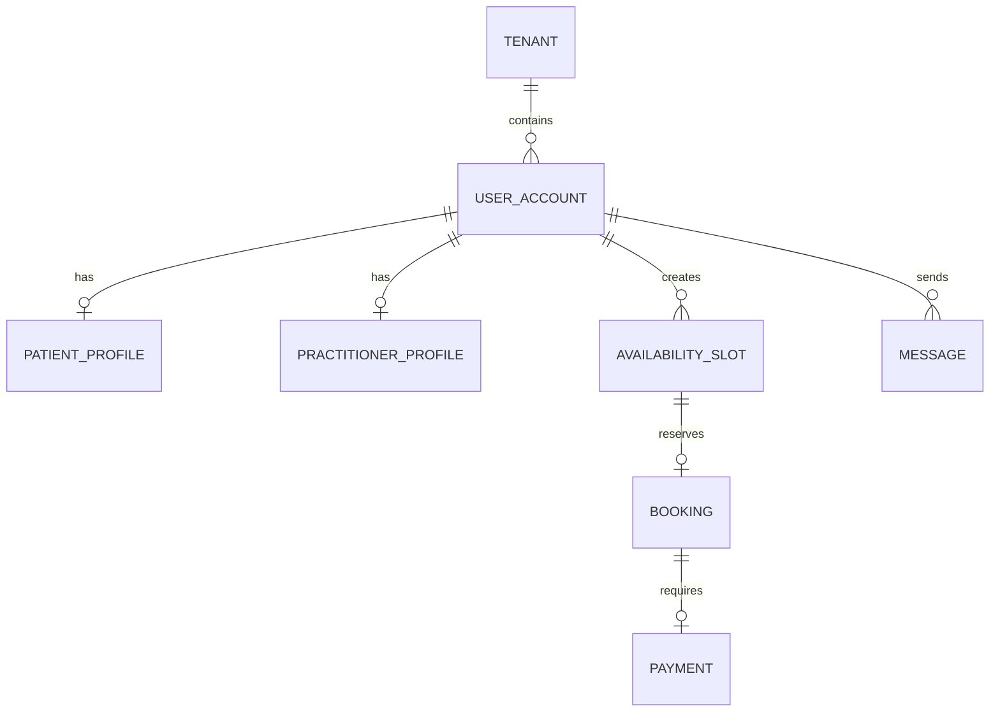

# M-Santé Backend - Implementation Overview

This document provides a comprehensive overview of the M-Santé healthcare platform backend implementation, following the specifications in `.github/instructions/msante-cahier-des-charges-architecture.instructions.md`.

## Architecture Overview

### 🏗️ System Architecture
```
┌─────────────────┐    ┌─────────────────┐    ┌─────────────────┐
│  Mobile/Web App │────│   API Gateway   │────│  Backend Services│
│      (PWA)      │    │   (Spring MVC)  │    │                 │
└─────────────────┘    └─────────────────┘    └─────────────────┘
                              │                         │
                              ▼                         ▼
                    ┌─────────────────┐    ┌─────────────────────┐
                    │  Authentication │    │    Core Services    │
                    │   (JWT + OTP)   │    │ - Booking           │
                    └─────────────────┘    │ - Scheduling        │
                              │            │ - Payment           │
                              ▼            │ - Messaging         │
                    ┌─────────────────┐    │ - Notifications     │
                    │    Security     │    └─────────────────────┘
                    │ - RBAC/ABAC     │              │
                    │ - Multi-tenant  │              ▼
                    │ - Audit         │    ┌─────────────────────┐
                    └─────────────────┘    │    Data Layer       │
                              │            │ - PostgreSQL        │
                              ▼            │ - Redis Cache       │
                    ┌─────────────────┐    │ - Row Level Security│
                    │  External APIs  │    └─────────────────────┘
                    │ - SMS/WhatsApp  │
                    │ - Mobile Money  │
                    │ - Payment PSPs  │
                    └─────────────────┘
```

### 🎯 Core Principles Implemented

1. **Multi-tenant SaaS Architecture**
   - Tenant isolation using UUID-based tenant_id
   - Row Level Security (RLS) in PostgreSQL
   - Configurable tenant-specific business rules

2. **Security-First Design**
   - OTP-based authentication for patients
   - JWT tokens with short expiration (15 minutes)
   - Role-based access control (RBAC)
   - Comprehensive audit logging

3. **Domain-Driven Design**
   - Clear service boundaries (identity, booking, payment, etc.)
   - Entity-centric data modeling
   - Business logic encapsulation in services

4. **Mobile-First API Design**
   - RESTful APIs with OpenAPI 3.1 documentation
   - Guest booking support (no account required)
   - Optimized for African mobile networks

## Implementation Details

### 📁 Project Structure
```
msante-backend/
├── src/main/java/sn/msante/
│   ├── MSanteBackendApplication.java      # Main Spring Boot application
│   ├── config/                            # Configuration classes
│   │   ├── SecurityConfig.java           # Spring Security configuration
│   │   └── OpenApiConfig.java            # API documentation setup
│   ├── controller/                        # REST API controllers
│   │   ├── AuthController.java           # Authentication endpoints
│   │   └── BookingController.java        # Booking management APIs
│   ├── dto/                              # Data Transfer Objects
│   │   ├── AuthResponseDto.java          # Authentication responses
│   │   ├── OtpRequestDto.java            # OTP request payload
│   │   ├── CreateBookingDto.java         # Booking creation payload
│   │   └── BookingDto.java               # Booking response data
│   ├── entity/                           # JPA entities
│   │   ├── BaseEntity.java               # Common audit fields
│   │   ├── Tenant.java                   # Multi-tenant organization
│   │   ├── UserAccount.java              # User authentication
│   │   ├── PatientProfile.java           # Patient medical data
│   │   ├── PractitionerProfile.java      # Healthcare provider data
│   │   ├── AvailabilitySlot.java         # Scheduling slots
│   │   ├── Booking.java                  # Appointment bookings
│   │   └── Payment.java                  # Transaction tracking
│   ├── exception/                        # Custom exceptions
│   ├── repository/                       # Data access layer
│   ├── security/                         # Security components
│   │   ├── JwtAuthenticationFilter.java  # JWT token validation
│   │   ├── MSantePrincipal.java          # Custom user principal
│   │   └── MSanteAuthenticationProvider.java
│   └── service/                          # Business logic services
│       ├── AuthenticationService.java    # OTP and JWT handling
│       ├── BookingService.java           # Appointment management
│       └── NotificationService.java      # SMS/WhatsApp messaging
├── src/main/resources/
│   ├── application.properties            # Main configuration
│   ├── application-dev.properties        # Development settings
│   └── db/
│       ├── migration/                    # Database schema
│       └── seed/                         # Sample data
└── src/test/java/                        # Test classes
```

### 🛡️ Security Implementation

#### Authentication Flow
1. **OTP Request**: Patient submits phone number
2. **OTP Delivery**: SMS/WhatsApp code sent (6-digit, 5-min expiry)
3. **OTP Verification**: Code validation with rate limiting
4. **JWT Generation**: Access token (15 min) + Refresh token (1 hour)
5. **API Access**: Bearer token authentication for protected endpoints

#### Authorization Model
```java
// Role-based access control
@PreAuthorize("hasRole('PATIENT')")
public List<BookingDto> getMyBookings() { ... }

@PreAuthorize("hasRole('PRACTITIONER') or hasRole('ADMIN')")
public List<BookingDto> getPractitionerBookings() { ... }

// Multi-tenant data isolation
@Query("SELECT b FROM Booking b WHERE b.tenant.id = :tenantId")
List<Booking> findByTenant(@Param("tenantId") UUID tenantId);
```

#### Data Protection
- **Encryption**: AES-256 for sensitive data at rest
- **TLS 1.2+**: All data in transit encrypted
- **PII Handling**: Minimal data collection, explicit consent
- **Audit Trail**: Complete action logging with immutable records

### 🏥 Healthcare Domain Model

#### Core Entities & Relationships


#### Business Rules Implementation
- **Slot Management**: Automatic conflict prevention
- **Cancellation Policy**: 72-hour default with tenant overrides
- **Payment Flow**: Booking → Payment → Confirmation → Slot Lock
- **Commission Calculation**: Configurable rates per tenant/method

### 📊 Database Design

#### Key Features
- **UUID Primary Keys**: Global uniqueness across tenants
- **Audit Columns**: created_at, updated_at on all entities
- **Enum Constraints**: Type safety for status fields
- **Optimized Indexes**: Performance for common query patterns
- **JSON Columns**: Flexible metadata storage (settings, responses)

#### Sample Queries
```sql
-- Find available slots for a practitioner
SELECT * FROM availability_slot 
WHERE practitioner_id = ? 
  AND is_booked = false 
  AND starts_at > NOW() + INTERVAL '15 minutes'
ORDER BY starts_at;

-- Get patient's booking history
SELECT b.*, p.first_name, p.last_name, s.starts_at
FROM booking b
JOIN practitioner_profile p ON b.practitioner_id = p.user_id
JOIN availability_slot s ON b.slot_id = s.id
WHERE b.patient_id = ?
ORDER BY s.starts_at DESC;
```

### 🔌 API Design

#### RESTful Endpoints
```yaml
# Authentication
POST /api/auth/otp          # Request OTP
POST /api/auth/verify       # Verify OTP & get tokens
POST /api/auth/refresh      # Refresh access token

# Booking Management
POST /api/bookings          # Create booking (guest or auth)
GET  /api/bookings/my       # User's bookings
GET  /api/bookings/guest    # Guest bookings by phone
PUT  /api/bookings/{id}/confirm   # Confirm after payment
PUT  /api/bookings/{id}/cancel    # Cancel appointment

# Practitioner Management
GET  /api/bookings/practitioner/{id}  # Practitioner schedule
```

#### Response Format
```json
{
  "booking_id": "uuid",
  "practitioner_name": "Dr. Amadou Diop",
  "starts_at": "2025-08-20T08:00:00Z",
  "ends_at": "2025-08-20T09:00:00Z",
  "consultation_mode": "IN_PERSON",
  "price_cfa": 15000,
  "status": "CONFIRMED",
  "can_be_cancelled": true,
  "cancellation_deadline": "2025-08-17T08:00:00Z"
}
```

### 📱 Mobile-First Considerations

#### Network Optimization
- **Minimal Payloads**: Only essential data in responses
- **Compression**: GZIP enabled for all text responses
- **Caching**: Redis for frequent queries (OTP, sessions)
- **Pagination**: Large result sets paginated by default

#### African Market Adaptations
- **Phone Number Normalization**: Senegal country code handling
- **Multiple Languages**: FR/EN/Wolof support ready
- **USSD Fallback**: Architecture ready for USSD integration
- **Offline Capability**: PWA caching for basic functionality

### 💰 Payment Integration Framework

#### Supported Methods
```java
public enum PaymentMethod {
    ORANGE_MONEY,    // Senegal's dominant mobile money
    WAVE,            // Growing fintech platform
    FREE_MONEY,      // Tigo/Airtel mobile money
    CARD,            // Traditional payment cards
    BANK_TRANSFER,   // Direct bank transfers
    CASH             // Cash payments at clinics
}
```

#### Transaction Flow
1. **Payment Intent**: Create payment with booking reference
2. **Gateway Integration**: Redirect/SDK call to payment provider
3. **Webhook Processing**: Async status updates from PSP
4. **Booking Confirmation**: Update booking status on success
5. **Payout Scheduling**: Queue practitioner payment

#### Commission Structure
```java
// Configurable commission rates
Integer grossAmount = booking.getSlot().getPriceCfa();
Integer commission = (int) (grossAmount * tenant.getCommissionRate());
Integer netAmount = grossAmount - commission;
Integer practitionerPayout = netAmount - platformFee;
```

### 🔔 Notification System

#### Multi-Channel Support
```java
@Service
public class NotificationService {
    
    public void sendOtp(String phone, String code, String channel) {
        if ("whatsapp".equals(channel)) {
            sendWhatsApp(phone, formatOtpMessage(code));
        } else {
            sendSms(phone, formatOtpMessage(code));
        }
    }
    
    public void sendAppointmentConfirmation(String phone, 
                                          String practitioner, 
                                          String datetime) {
        String message = String.format(
            "[M-Santé] RDV confirmé avec %s le %s. Code: %s",
            practitioner, datetime, generateBookingCode()
        );
        sendSms(phone, message);
    }
}
```

#### Message Templates (Localized)
```properties
# French (default)
otp.message=Votre code M-Santé: {code}. Valide 5 min.
booking.confirmed=RDV confirmé avec {doctor} le {date}. Code: {code}

# Wolof
otp.message.wo=Sa code M-Santé: {code}. 5 min rekk.
booking.confirmed.wo=RDV yi confirmé ak {doctor} ci {date}
```

### 🧪 Testing Strategy

#### Test Pyramid
```
                 ▲
                / \
               /   \    E2E Tests (API Integration)
              /     \   
             /       \  
            /         \ Integration Tests (Service Layer)
           /           \
          /_____________\ Unit Tests (Logic & Validation)
```

#### Key Test Areas
1. **Authentication Flow**: OTP generation, validation, JWT creation
2. **Booking Workflows**: Slot conflicts, cancellation policies
3. **Security**: Authorization, data isolation, injection prevention
4. **Data Integrity**: Constraint validation, transaction rollbacks

### 🚀 Deployment Considerations

#### Environment Configuration
```yaml
# Development
spring.profiles.active: dev
spring.datasource.url: jdbc:h2:mem:msante_dev
logging.level.sn.msante: DEBUG

# Production  
spring.profiles.active: prod
spring.datasource.url: jdbc:postgresql://db:5432/msante
msante.security.cors.allowed-origins: https://app.msante.sn
```

#### Container Readiness
```dockerfile
FROM openjdk:17-jre-slim
COPY target/msante-backend-1.0.0.jar app.jar
EXPOSE 8080
HEALTHCHECK --interval=30s --timeout=3s --start-period=30s \
  CMD curl -f http://localhost:8080/actuator/health || exit 1
ENTRYPOINT ["java", "-jar", "/app.jar"]
```

#### Monitoring & Observability
- **Health Checks**: Spring Actuator endpoints
- **Metrics**: Prometheus integration ready
- **Logging**: Structured JSON logs for aggregation
- **Tracing**: OpenTelemetry preparation

## Compliance & Governance

### 🛡️ Data Protection (CDP/RGPD)
- **Lawful Basis**: Consent + Contract execution for healthcare
- **Data Minimization**: Only collect necessary health information
- **Consent Management**: Explicit, granular, revocable permissions
- **Right to Access**: Patient data export functionality
- **Right to Erasure**: Account deletion with anonymization
- **Data Portability**: Structured export formats (JSON/PDF)

### 📋 Audit Requirements
```sql
-- Audit log structure
CREATE TABLE audit_log (
    id UUID PRIMARY KEY,
    tenant_id UUID NOT NULL,
    user_id UUID NOT NULL,
    action VARCHAR(50) NOT NULL,
    resource_type VARCHAR(50) NOT NULL,
    resource_id UUID,
    details JSONB,
    ip_address INET,
    user_agent TEXT,
    timestamp TIMESTAMPTZ NOT NULL DEFAULT now()
);
```

### 🏥 Healthcare Compliance
- **Data Encryption**: AES-256 for PHI at rest
- **Access Controls**: Role-based with audit trails
- **Retention Policies**: 7-year default for medical records
- **Incident Response**: Breach notification procedures
- **Professional Verification**: Manual KYC for practitioners

## Future Enhancements

### 📅 Roadmap (Post-MVP)
1. **Advanced EHR**: FHIR R4 compliance for interoperability
2. **Telemedicine**: Video calling with recording capabilities
3. **Prescription Management**: Digital prescription with e-signatures
4. **Laboratory Integration**: Test orders and result delivery
5. **Insurance Claims**: Automated claim processing
6. **Analytics Dashboard**: Business intelligence for healthcare insights
7. **Mobile Apps**: Native iOS/Android applications
8. **AI/ML Features**: Symptom checking, appointment optimization

### 🔧 Technical Improvements
- **Microservices**: Split into independent deployable services
- **Event Sourcing**: Complete audit trail with event replay
- **CQRS**: Separate read/write models for performance
- **GraphQL**: Flexible client-driven data fetching
- **Blockchain**: Immutable medical record verification
- **Edge Computing**: Regional data processing for latency

## Conclusion

The M-Santé backend provides a solid foundation for a comprehensive healthcare platform tailored to the Senegalese and West African market. Key achievements include:

✅ **Secure Architecture**: OTP authentication, JWT tokens, role-based access
✅ **Healthcare Domain**: Complete booking workflow with payment integration  
✅ **Multi-tenant SaaS**: Scalable architecture for multiple healthcare organizations
✅ **Mobile-First Design**: Optimized for African mobile networks and usage patterns
✅ **Compliance Ready**: GDPR/CDP frameworks with audit trails
✅ **Developer Experience**: Comprehensive documentation, testing, and tooling

The implementation follows Spring Boot best practices while addressing the unique requirements of the African healthcare market, providing a platform that can scale from individual practitioners to large hospital networks.

---

**Next Steps**: Deploy to staging environment, integrate real payment gateways, conduct security penetration testing, and begin user acceptance testing with pilot healthcare providers in Dakar.